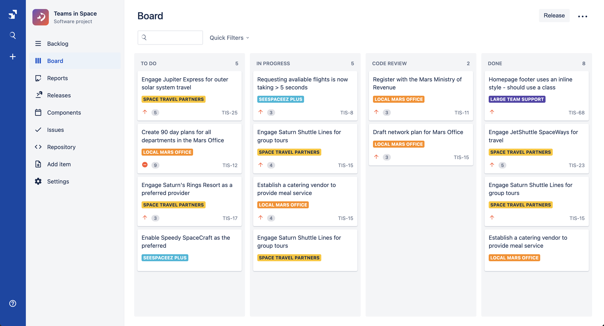
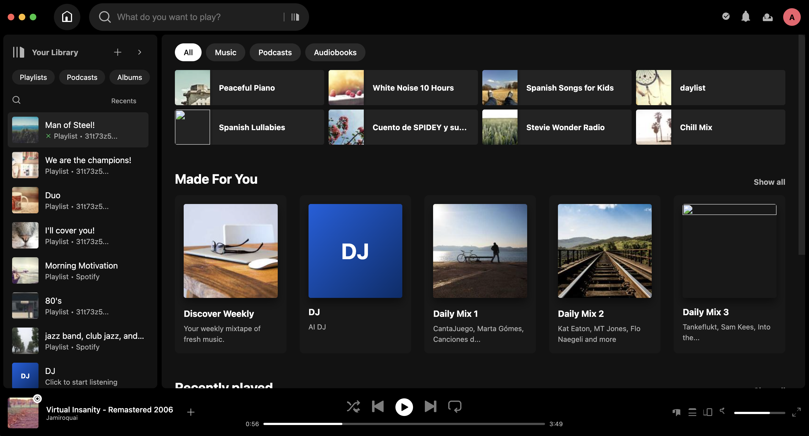
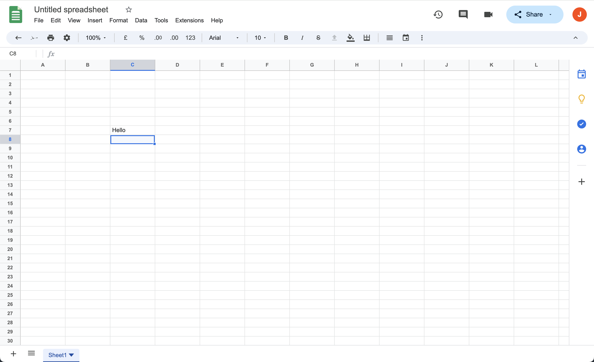

# LLM UI Challenge

How well can LLMs replicate UIs from screenshots?
This project tests how well different LLMs can recreate application interfaces from screenshots.

**[View all examples in the full gallery](https://alechewitt.github.io/llm-ui-challenge)**

## The Prompt

Each model received the same simple prompt along with a reference screenshot:

```
Generate this {APPLICATION_NAME} interface in HTML, CSS and JavaScript.
Return a single HTML file with embedded CSS and JavaScript.
```

## Highlights

Here are some of the most impressive outputs:

---

### Microsoft Word by GPT-5.1


[View the live HTML](https://alechewitt.github.io/llm-ui-challenge/outputs/microsoft_word/gpt_5_1.html)

This one impressed me with how much actually works. The text formatting buttons are functional, the zoom slider works, and you can change paragraph alignment. That said, it's missing the word count feature that Opus and Gemini both implemented.

---

### Jira by Gemini 3 Pro Preview



[View the live HTML](https://alechewitt.github.io/llm-ui-challenge/outputs/jira/gemini_3_pro_preview.html)

This looks almost identical to the real Jira interface. What really stands out is that you can actually drag cards between columns, and there's a nice smooth animation when you do. The card count at the top of each column even updates when you move things around.

---

### Spotify by Gemini 3 Pro Preview



[View the live HTML](https://alechewitt.github.io/llm-ui-challenge/outputs/spotify/gemini_3_pro_preview.html)

If it wasn't for the missing album artwork images, I would have been fooled into thinking this was the real Spotify interface. The visual fidelity is remarkably close to the original. Though it's worth noting there aren't any actual functionality or interactive features beyond the appearance.

---

### Google Sheets by Gemini 3 Pro Preview



[View the live HTML](https://alechewitt.github.io/llm-ui-challenge/outputs/google_sheets/gemini_3_pro_preview.html)

This is arguably the most impressive of all the interfaces. Gemini even implemented the Google Sheets logo as an SVG! You can navigate around the different cells, and it correctly updates the cell reference (like "A1", "B2") when you select a cell. You can type both directly in cells and in the formula bar at the top. The only thing missing is that none of the formatting buttons actually work.

---

## How It Was Built

This entire project was created using Claude Code. You can check out [`initial_prompt.txt`](initial_prompt.txt) to see the original prompt that kicked everything off, along with the resulting [`create_interface.py`](create_interface.py) for calling the OpenRouter API and [`capture_screenshots.py`](capture_screenshots.py) for taking screenshots of the generated HTML pages.

After the initial creation, a few follow-up prompts were needed. Some of the Gemini outputs were getting truncated because OpenRouter was setting a max token limit on the API calls, so those had to be regenerated. There was also a round of regenerating screenshots that were captured at awkward aspect ratios that made them difficult to compare.

### Models Tested

- Claude Sonnet 4.5
- Claude Opus 4.5
- GPT-5.1
- GPT-5.1 Codex
- Gemini 2.5 Pro
- Gemini 3 Pro Preview
- Grok 4 Fast
- Qwen3 VL 235B

### Applications

- Microsoft Word
- Jira
- Spotify
- VS Code
- Google Sheets

## View All Results

Check out the [full gallery](https://alechewitt.github.io/llm-ui-challenge) to see outputs from all models across all applications.
